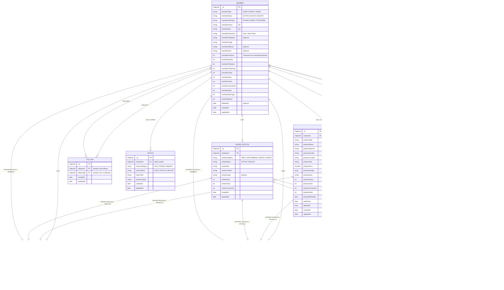

# ER Model: Petoria (pet shop)

> Status as of **2026-10-05** · branch `modification` · **implemented** in the backend (product module). The `properties` collection was dropped from the dev DB.
> The **Domain Rules** in `CLAUDE.md` win over this file. Product details were confirmed by the owner on 2026-10-05. Items marked 🟡 are still open.

The database is MongoDB, so there are no real foreign keys. A "FK" below is an `ObjectId` field that points to another collection. The code (services and `$lookup`) keeps the links correct, not the database.

## 1. Diagram

## 2. Collections

| Entity | Collection | Status |
|---|---|---|
| `MEMBER` | `members` | Exists. Only change: `memberProperties` → `memberProducts` |
| `PRODUCT` | `products` | **New**. Replaces `properties`, which was dropped from the dev DB on 2026-10-05 (it had 0 documents) |
| `BOARD_ARTICLE` | `boardArticles` | Exists, no change |
| `COMMENT` | `comments` | Exists. Group value `PROPERTY` → `PRODUCT` |
| `LIKE` | `likes` | Exists. Group value `PROPERTY` → `PRODUCT` |
| `VIEW` | `views` | Exists. Group value `PROPERTY` → `PRODUCT` |
| `FOLLOW` | `follows` | Exists, no change |
| `NOTICE` | `notices` | Exists, no module yet |
| `NOTIFICATION` | `notifications` | Exists, no module yet. `propertyId` → `productId` (ref `'Product'`), group `PROPERTY` → `PRODUCT` |

## 3. Relationships in plain words

| From | To | Type | How it is stored |
|---|---|---|---|
| Member (AGENT) | Product | 1 → many | `products.memberId`. Only `AGENT` members can create products (`@Roles(MemberType.AGENT)`) |
| Member | Board article | 1 → many | `boardArticles.memberId` |
| Member | Member (follow) | many ↔ many | The `follows` collection is the join table: `followerId` + `followingId`. Unique pair |
| Member | Like | 1 → many | `likes.memberId`. One member can like one target only once (unique `memberId + likeRefId`) |
| Member | View | 1 → many | `views.memberId`. One view per member per target (unique `memberId + viewRefId`) |
| Like / View / Comment | Product, Board article, or Member | many → 1 | **Polymorphic link**: one id field (`likeRefId`, `viewRefId`, `commentRefId`) plus a group field that says which collection it points to |
| Member (ADMIN) | Notice | 1 → many | `notices.memberId` |
| Notification | Member | many → 1 (twice) | `authorId` (who did it) and `receiverId` (who gets it) |
| Notification | Product / Board article | many → 0..1 | `productId` or `articleId`, chosen by `notificationGroup` |

## 4. Product rules

| Rule | Detail |
|---|---|
| Type | `productType`: `PET`, `FOOD`, `TOY`, `ACCESSORY` (required) |
| Species | `productSpecies`: `DOG`, `CAT`, `BIRD`, `FISH` (required). For goods it means "made for this animal", e.g. dog food |
| Gender | `productGender`: `MALE`, `FEMALE`. 🟡 Used only when `productType = PET`, empty for other types. The service checks this |
| Status | `ProductStatus`: `ACTIVE` → `SOLD_OUT` (sets `soldOutAt`) or `DELETE` (sets `deletedAt`) |
| Location | `ProductLocation`: same city list as before (`SEOUL`, `BUSAN`, `INCHEON`, `DAEGU`, `GYEONGJU`, `GWANGJU`, `CHONJU`, `DAEJON`, `JEJU`), required |
| Birth date | `productBirthDate`: optional, only for `PET`. Replaces the old `constructedAt` |
| Unique index | 🟡 `{ memberId: 1, productTitle: 1 }`: one agent cannot list two products with the same title |
| Counters | `productViews`, `productLikes`, `productComments` are updated by the view, like, and comment services. `productRank` is set by the batch app |
| Rank formula | `productRank = productLikes * 2 + productViews` (same as the old property formula) |
| Agent rank | `memberRank = memberProducts * 5 + memberArticles * 3 + memberLikes * 2 + memberViews` |

## 5. Removed property fields

These real-estate fields are **not** in the product model and must not come back: `propertyAddress`, `propertySquare`, `propertyBeds`, `propertyRooms`, `propertyBarter`, `propertyRent`, `constructedAt`, and the `SquaresRange` filter.

Not added on purpose (owner decision, 2026-10-05): `productStock`, `productBrand`, `productOnSale`, `productFreeDelivery`. Because of this the old `options` filter (`availableOptions`) is removed too.
